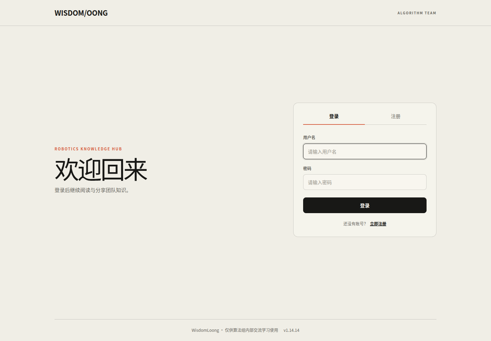
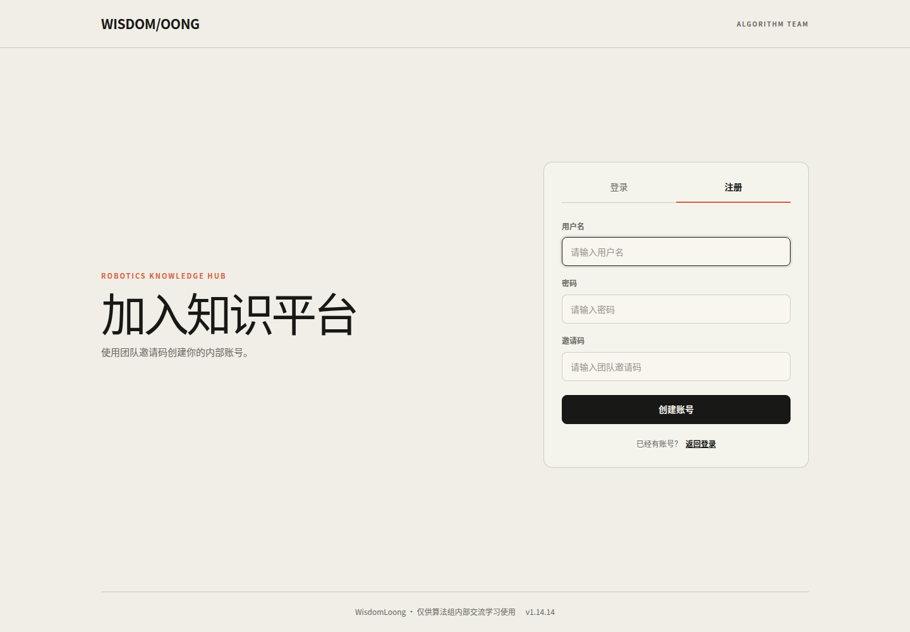
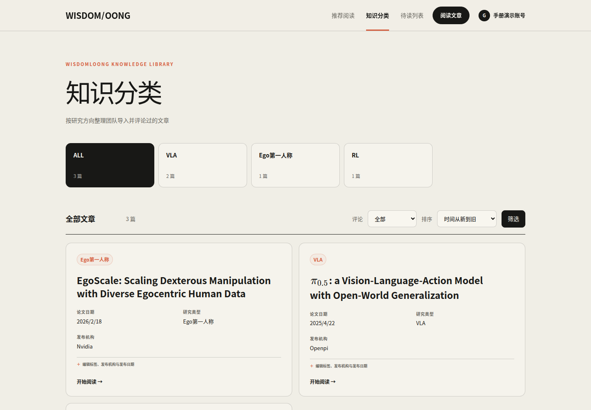
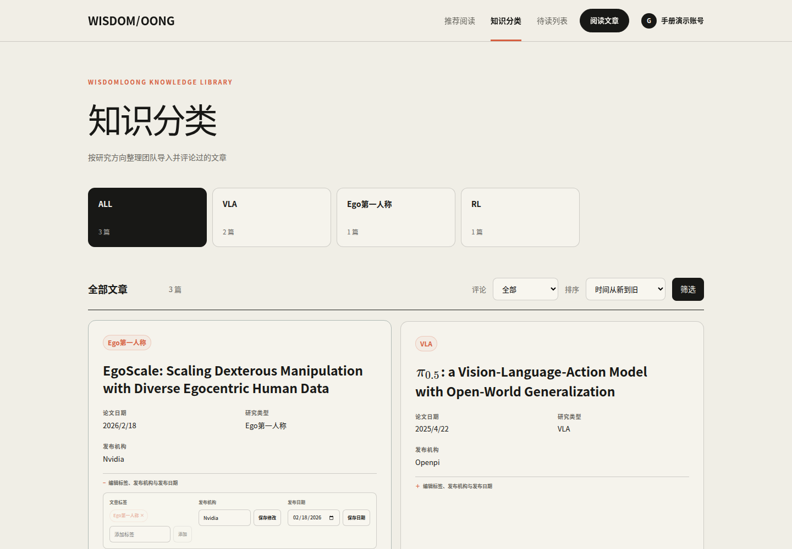
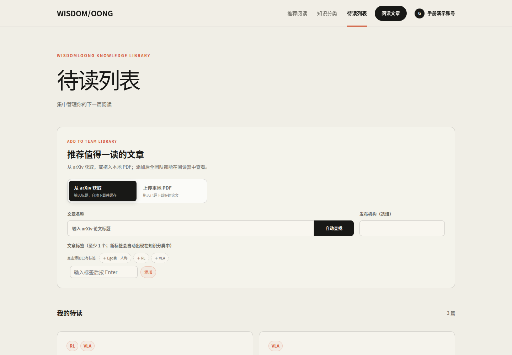
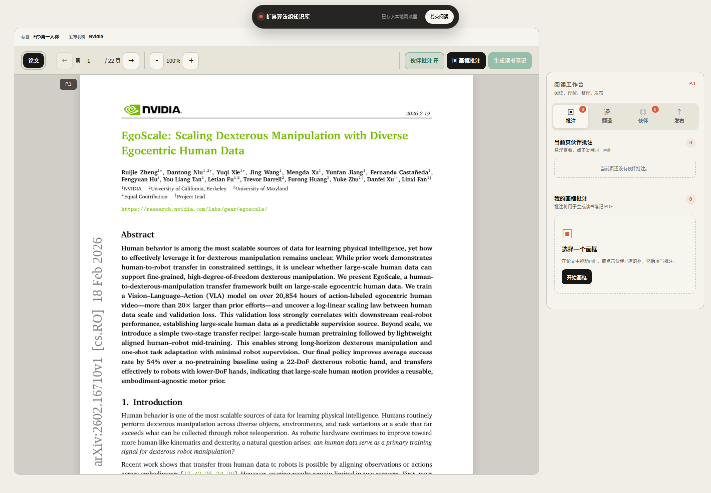
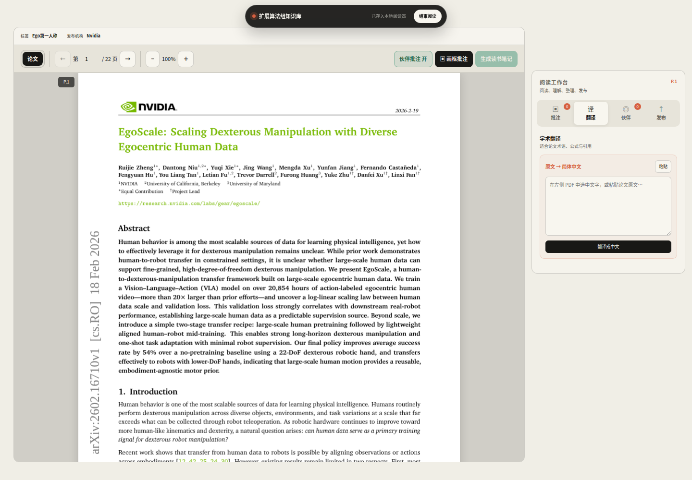
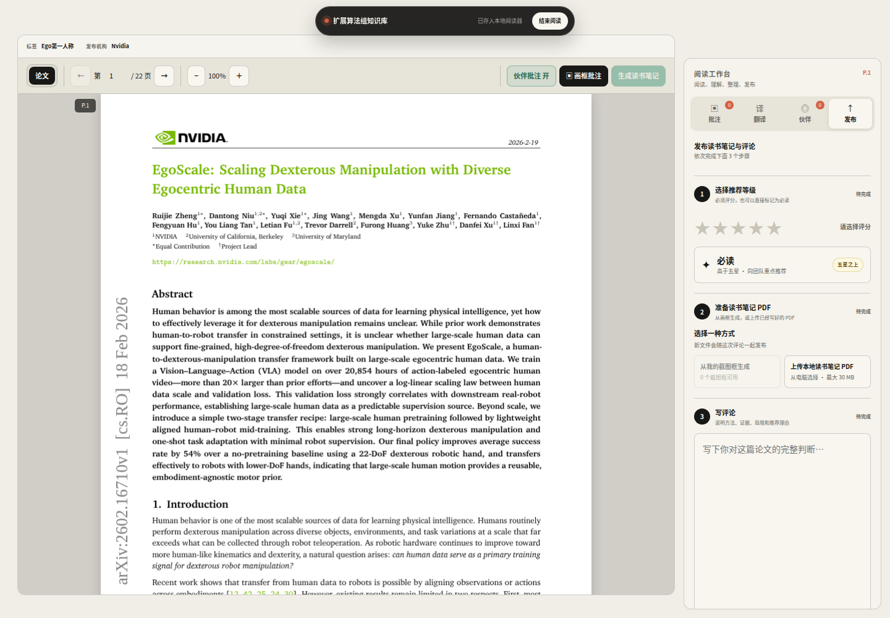
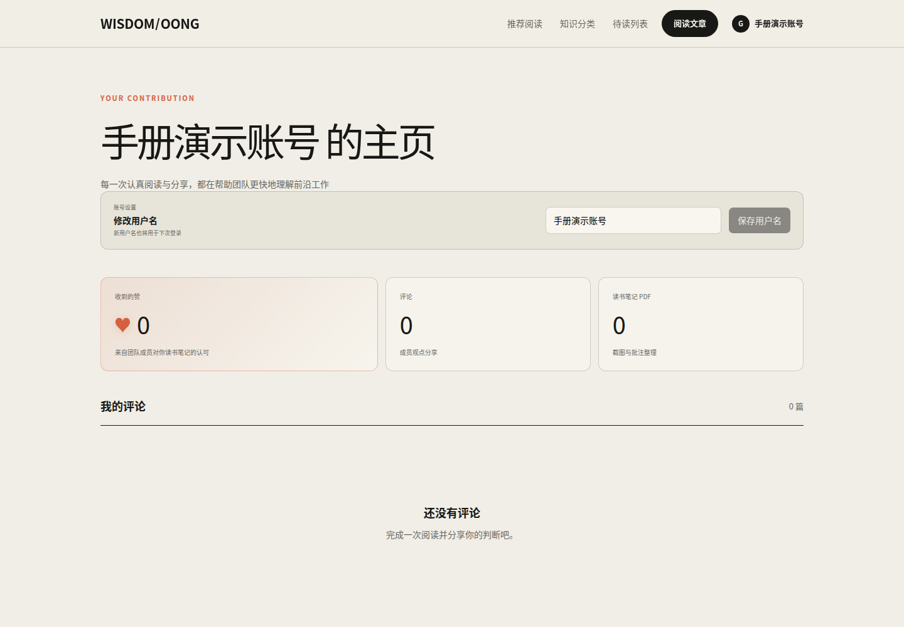

# 扩展算法组知识库 · 用户使用手册

这份手册面向普通成员。按下面的顺序操作，就能完成一次完整的论文阅读和分享。

> 最短流程：注册或登录 → 找到论文 → 进入阅读器 → 画框批注或翻译 → 准备读书笔记 PDF → 评分并写评论 → 发布。

## 目录

1. 注册和登录
2. 查找论文
3. 推荐或上传论文
4. 使用阅读器
5. 画框批注
6. 翻译论文原文
7. 生成读书笔记并发布
8. 查看伙伴内容和点赞
9. 个人主页和修改用户名
10. 常见问题

## 1. 注册和登录

打开 `https://wisdomloong.com`。已有账号时，输入用户名和密码登录。

第一次使用时，点击“立即注册”，填写：

1. 用户名
2. 密码
3. 团队邀请码

## 2. 查找论文

登录后，顶部有三个主要入口：

- “推荐阅读”：查看伙伴推荐的论文。
- “知识分类”：查看全部论文，可按标签、评论状态和时间筛选。
- “待读列表”：查看还没有读完的论文，也可以推荐新论文。

点击论文标题，就会进入阅读器。

### 修改论文信息

在阅读器外面的文章卡片中，点击“编辑标签、发布机构与发布日期”，可以：

- 添加或删除标签。
- 添加或修改发布机构。
- 添加、修改或清空发布日期。

阅读器内只显示这些信息，不能修改。

## 3. 推荐或上传论文

进入“待读列表”，在“推荐值得一读的文章”区域选择一种方式：

- 从 arXiv 查找：输入论文标题或 arXiv 信息，确认结果后添加。
- 上传本地 PDF：选择 PDF，补充标题、作者、标签、发布机构和发布日期后上传。

新论文会进入团队文章库。

## 4. 使用阅读器

阅读器以论文为中心：左边是 PDF，右边是阅读工作台。

阅读时：

- 页面采用连续长条阅读，没有翻页模式。
- PDF 每次打开都会自动适应阅读器宽度，阅读区尺寸变化时也会自动重新排版。
- 按 `Esc` 不会退出阅读。
- 必须点击顶部“结束阅读”才能退出专注阅读。
- 顶部“论文 / 某某的笔记”可以在论文和伙伴读书笔记 PDF 之间切换。
- “他人批注”开关只控制是否显示别人的批注，不影响自己画框。
- 阅读到需要暂停的位置时，点击顶部“加书签”，然后在 PDF 中点击当前读到的那一行；页面会出现一条书签线。下次打开会定位到该位置，也可以点击“回到书签”随时返回。
- 右侧“我的批注”和“他人批注”可以分别通过标题前的小三角展开或收起。

## 5. 画框批注

批注分为图片批注和文字批注。

1. 点击“图片批注”后拖动画框，或点击“文字批注”后拖选 PDF 文字。文字批注会保留逐行的不规则轮廓，生成读书笔记时自动翻译。
2. 在 PDF 的图片、公式或段落外拖出一个框。
3. 在右侧填写批注文字。
4. 点击“加入批注”。

批注加入或删除后会立即保存，不需要等到发布评论。如果当时网络失败，本机会保留副本并在下次打开时自动重试。

如果伙伴已经在同一位置画过框，可以直接点击伙伴的框，复用同一个位置写自己的批注。

不同成员使用不同颜色；同一成员的不同批注使用数字编号。把鼠标移到框或批注文字上，可以找到互相对应的内容。重叠的框会错开显示。

## 6. 翻译论文原文

1. 在 PDF 中选中英文原文，阅读工作台会自动切换到“翻译”。
2. 也可以把原文直接粘贴到输入框。
3. 点击“翻译成中文”。
4. 译文会边生成边显示，不必等整段全部完成。

翻译会保留论文中的公式、变量、引用、模型名、数据集名和常见英文缩写。相同原文再次翻译时通常会更快。

## 7. 生成读书笔记并发布

打开右侧“发布”，按页面中的三个步骤完成。

### 第 1 步：选择推荐等级

必须选择 1–5 星；如果这篇论文非常重要，也可以选择“必读”。系统不会默认替你打分。

### 第 2 步：准备读书笔记 PDF

二选一：

- “从我的截图框生成”：把自己的画框截图和批注文字自动排版成 PDF。
- “上传本地读书笔记 PDF”：直接上传已经写好的 PDF，最大 30 MB。

发布前可以预览新生成或新选择的 PDF。

### 第 3 步：写评论

建议说明：论文解决了什么问题、用了什么方法、证据是否充分、有什么局限、为什么值得团队关注。

三个步骤都显示“已完成”后，点击“发布读书笔记与评论”。

## 8. 查看伙伴内容和点赞

右侧“伙伴”集中显示其他成员的评论和读书笔记 PDF。

- 点击“在阅读器打开笔记”，直接在同一个阅读器中查看伙伴的 PDF。
- 再点击顶部“论文”，返回论文原文。
- 点赞对象是整份读书笔记 PDF，不是单条批注。
- 在阅读器打开伙伴笔记后，可直接使用工具栏中的醒目点赞按钮。打开自己的笔记时，同一位置会显示读过该笔记的人数。
- 成员评论中不会逐页展开批注。

## 9. 个人主页和修改用户名

点击右上角头像，再点击“我的主页”。这里可以查看自己的评论数、读书笔记数和收到的赞，也可以修改用户名。

## 10. 常见问题

### 为什么看不到他人批注？

先确认 PDF 已经加载完成，再确认工具栏中的“他人批注”已开启。这里只显示当前论文对应页面的批注。

### 为什么不能发布？

检查发布区的三个步骤：必须评分、必须有读书笔记 PDF、必须填写评论。

### 为什么“从我的截图框生成”不能点击？

需要先在论文中至少完成一个画框批注，并等待 PDF 加载完成。

### 可以上传自己写的读书笔记吗？

可以。在发布流程第 2 步选择“上传本地读书笔记 PDF”。

### 如何退出阅读？

点击页面顶部的“结束阅读”。`Esc` 不会退出。

### 翻译失败怎么办？

先缩短选中的原文再重试。如果仍然失败，稍后再试或联系管理员检查翻译服务。
